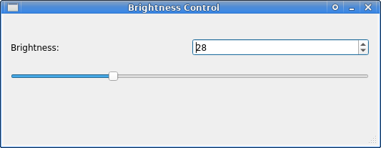

# Description 

A simple GUI tool to set the backlight brightness.

# Setup 

1. Install Python dependencies: `./install-deps.sh`
2. Setup brightness file permissions: `./setup-permissions.sh`

# Usage 

`./run`

# Development

If you edit the `.ui` file, you must transpile it to `mainwindow.py` file by issuing `make`.
